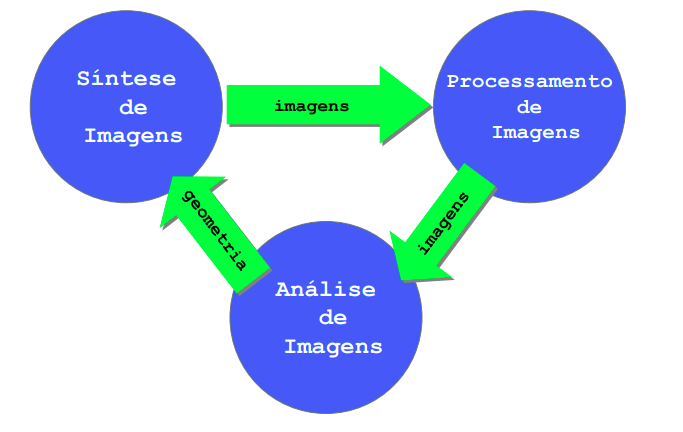

## Em Aula

- Areas
   - in->dados out->dados isso é uma modelagem geometrica
        - 

   - in->imagem out->dados : analise de imagens
        - identificar os objetos a partir da imagem

   - in->dados out->imagens : sintese de imagens 

   - in->imagem out->imagens : processamento de imagem
        - apliçao de filtro por exemplo

## Para Casa
- Leitura: https://hbatagelo.github.io/cg/intro.html
    - 2, 2.1, 2.2
- Adiantado(opcional) --> (08/10 - Ter) Topico de sistemas gráficos

## Links úteis
- https://www.youtube.com/playlist?list=PLtLqKTVlt8nFTn6uBbJ-f9sRzmyE4euRX
- https://hbatagelo.github.io/cg/
- https://learnopengl.com/