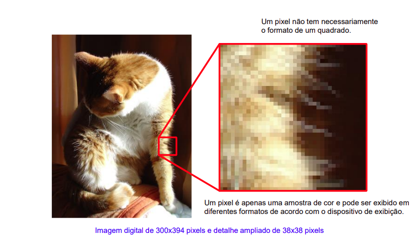

# Cores

## RGB
no opengl vai de 0 a 1

Exemplo
 r: 0.8 g:0 b:1

## CMYK
modelo subtrativo, usado em impressoras. O K é a key color(Preto) que facilita a exibição de tons mais escuros, evitando gastar tanto dos cartuchos coloridos

## HSL e HSV

Hue Saturation Lightness ou
Hue Saturatuin Values

---
# Vetorial x Matricial

A representação vetorial é utilizada na descrição de formas 2D e 3D

Já a reresentação matricial é utilizada em imagens e definição de texturas

## Rasterização
Processo de converter representações vetoriais em representações matriciais

Na propria imagem acima a primeira já seria uma representçao matricial, pois a vetorial já foi convertida(em alta resoluçao) pois imagens em dispositivos de saida ja são matriciais*

~ *Ver melhor se é isso mesmo

## Representação Vetorial

- **MoveTo** *M*
    move a "caneta virtual" pra posição desejada 
- **LineTo** *L*
    traça um segmento de reta de uma posição ate outra
- **ClosePath** *Z*
    traça um segmento que fecha o caminho da posição atual ao ponto inicial

## Representação Matricial
Arranjos bidimensionais de pixels

- A resolção da imagem é o numero de linhas e colunas do arranjo bidimensional

- Uma imagem digital pode ser armazenada como um mapa de bits (**bitmap**)
- quantidade de cores que podem ser representadas por um pixel (**Color depth**) depende do número de bits designados a cada pixel
    - ou seja, em uma profundidade de cor de 8 bits, cada pixel pode assumir 256 valores

- **Dithering** é o processo de introduzir ruído ou um padrão de pontilhados

- Formato de **cor indexada**, em uma imagem de 8 bits, a paleta de cores é uma tabela de 256 cores, sendo cada cor definida por 3 bytes, um pra cada componente de cor RGB. 
    - Ou seja, é necessário a definição da paleta de cores

- **True Color**, formato usado atualmente, onde cada pixel tem 24bits(3 bytes, um pra cada componente rgb), sem o uso da paleta de  cores
    - possivilita a exibição de 2^24^ cores simultâneas (aprox. 16M)

---
# Dispositivos de Entrada e Saída

## Dispositivos Vetoriais

- **CRT vetorial** (tubos de raios catódicos), foi o primeiro dispositivo de exibição utulizado em computador. Usa a mesma tecnologia de osciloscópios analógicos 
    - no CRT um canhão de elétrons emite um feixe que incide sobre uma tela revestida por um material fotoluminescente(Fósforo)
    - Como o brilho do fósforo tem baixa persistencia, é preciso redesenhar o traço continuamente
    - Desvantagens como a velocidade de geração e a dificuldade de desenhar de forma adequada áreas preenchinas, fizeram eles serem substituidos

- **CRT matricial** o feixe de eletrons é direcionado por deflexão eletromagnetica e varre continuamente a tela de cima para baixo, da esquerda pra direita

    - nos CRT's coloridos era utilizado shadow mask/slot mask para controlar a precisão do feixe de eletrons 
    
    - Também pararam de ser utilizados e foram substituidos por monitores LCD (Liquid-crystal display)

- **Display de Plasma** 

- **Display de LCD**

- **Display OLED** (organic light-emitting diodes)
    - nao usam luz de fundo
---
# Framebuffer
- área contígua de memória de vídeo, utilizada para armazenar a imagem que será mostrada no dispositivo de exibição

