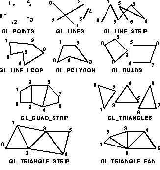
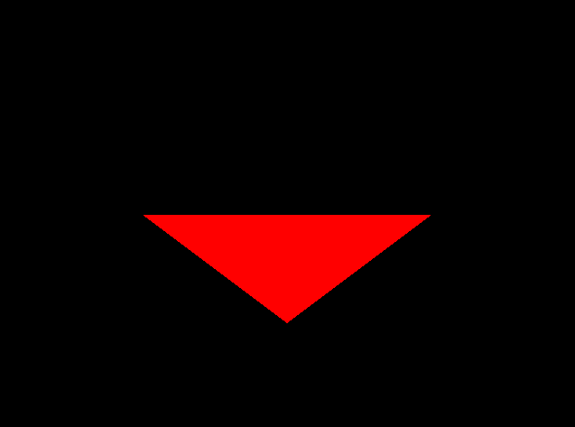
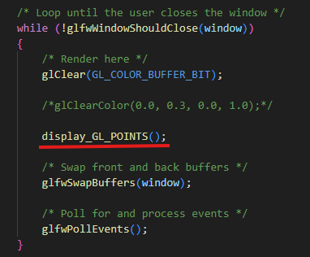
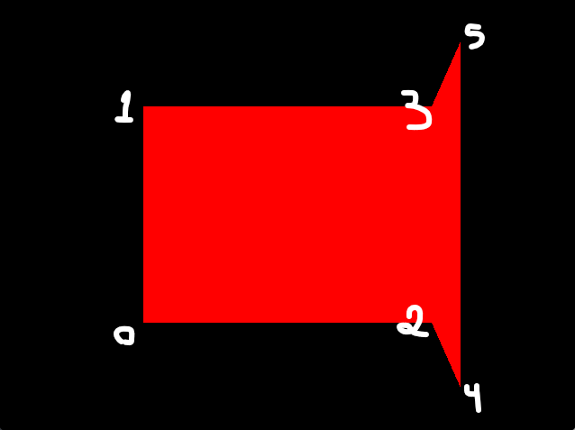

# OpenGL

## Primitivas


Exemplo de código usando GL_TRIANGLES:

```
void display_GL_POINTS()
{
    glColor3f(1.0, 0.0, 0.0);
    /*glPointSize(20.0);*/

    glBegin(GL_TRIANGLES);
        glVertex3f(0.5, 0.0, 0.0);
        glVertex3f(-0.5, 0.0, 0.0);
        glVertex3f(0.0, -0.5, 0.0);
        glVertex3f(0.0, 0.5, 0.0); 
    glEnd();
}
/*Aqui podemos usar glVertex2f já que estamos apenas no plano 2D*/
```

Para rodar a função acima, que desenha as figuras, precisamos fazer a chamada dela no loop de atualização da tela



Aqui temos que nos atentar a ordem em que o QUAD_STRIP liga os pontos
```
void display_GL_POINTS()
{
    glColor3f(1.0, 0.0, 0.0);
    /*glPointSize(20.0);*/

    glBegin(GL_QUAD_STRIP);
        glVertex2f(-0.5, -0.5);/*0*/
        glVertex2f(-0.5, 0.5); /*1*/
        glVertex2f(0.5, -0.5); /*2*/
        glVertex2f(0.5, 0.5);  /*3*/
        glVertex2f(0.6, -0.8); /*4*/
        glVertex2f(0.6, 0.8);  /*5*/
    glEnd();
}
```
