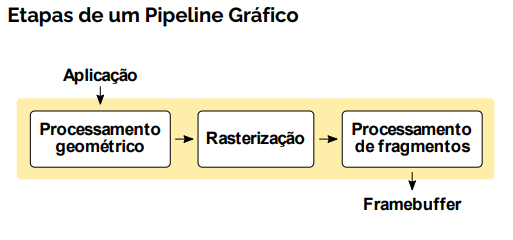
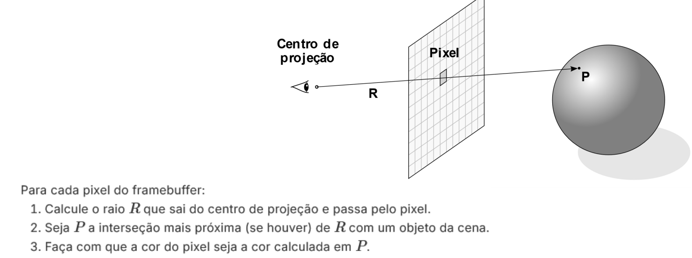
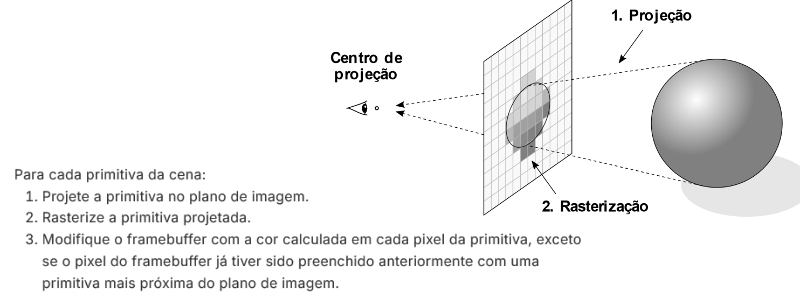

# Pipeline Gráfico

- Processamento geométrico
    - envolve transformações efetuadas sobre os vértices

- Rasterização 
    - conversão matricial das primitivas

- Processamento de Fragmentos
    - operações realizadas sobre cada fragmento para determinar sua cor e outros atributos

### Ray Casting x Rasterização
duas abordagens distintas de se renderizar uma cena

- **Ray casting**
    - lança raios que saem do centro de projeção, atravessam os pixels da tela e intersectam os objetos da cena

    - no ray casting, cada pixel é visitado apenas uma vez
    - entretanto, para cada pixel visitado, potencialmente todos os objetos da cena podem ser consultados para calcular a interseção mais próxima
    - Assim, o principal custo da geração de imagem usando ray casting está relacionado ao cálculo das interseções
    - Ele funciona lançando linhas retas (raios) da câmera para cada pixel da tela, e descobrindo qual objeto o raio atinge primeiro
    - Com essa informação, o ray casting desenha a cor do objeto naquele pixel, criando a ilusão de profundidade e formas no espaço 3D
        - Estruturas de dados de subdivisão espacial podem ser utilizadas para que seja possível descartar rapidamente a geometria não intersectada pelo raio e com isso diminuir o número de testes de interseção
        - Embora o ray casting seja conceitualmente simples, exige a manutenção da estrutura de aceleração na memória do renderizador
        - Essa limitação tem sido cada vez menos significativa nas GPUs mais recentes

---

- **Rasterização**
    - faz o caminho inverso: os objetos da cena são projetados na tela na direção do centro de projeção, e são então convertidos em pixels

    - na etapa 3, a cor do pixel é geralmente avaliada através de um modelo de iluminação local.
    - Outras técnicas podem ser utilizadas para melhorar a aproximação da luz refletida no ponto amostrado, mas não há lançamento de raios ou testes de interseção como no ray casting.
    - A rasterização é mais adequada para implementação em hardware, pois cada iteração do laço principal só precisa armazenar a primitiva que está sendo processada, juntamente com o conteúdo do framebuffer
    - Como resultado, o processamento de transformação geométrica de vértices e a conversão matricial podem ser paralelizados de forma massiva, como de fato ocorre nas GPUs
