# Transformações geométricas
 - operações aplicadas à descrição geométrica de um objeto (vértices)
    mudando: 
    ❑ posição (**translação**)
    ❑ orientação (**rotação**)
    ❑ tamanho (**escala**)
    
### Translação
- deslocamento constante sem alteração da forma, ou seja, todos os ponto se movem na mesma direção com a mesma magnitude
- É uma adição de matrizes (diferente das outras duas)
    - mas há formas de fazer com que ela seja multiplicação igual as outras
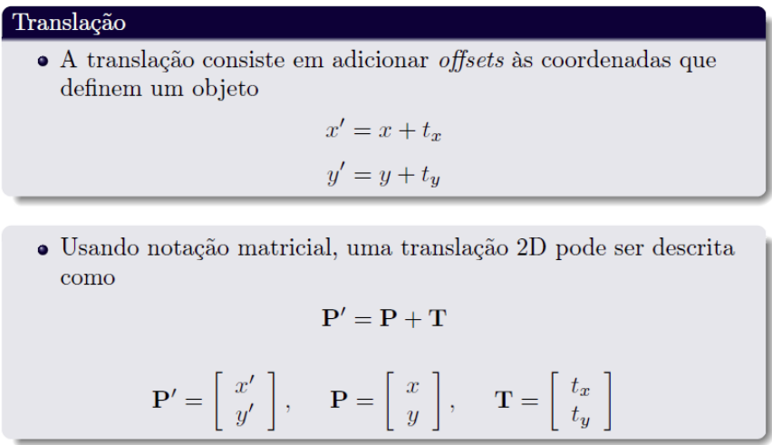
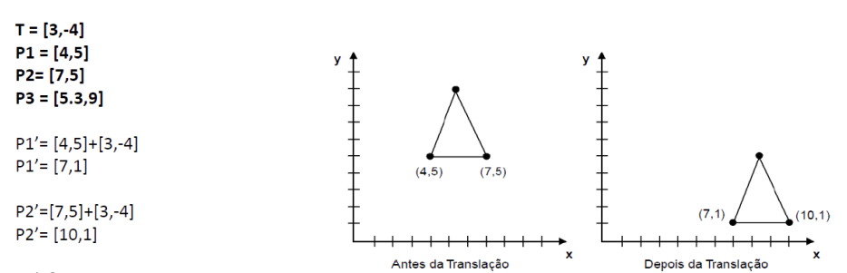

- é chamada de **transformação de corpo rígido**, assim como a rotação, pois preserva a distância entre todos os pontos do objeto transformado

### Rotação
- movimento de um objeto ao redor deum ponto fixo ou eixo, sem alterar seu tamanho ou forma
- Cada ponto do objeto gira em um ângulo específico ao redor desse ponto ou eixo, mantendo uma distância constante em relação a ele
- #### Características
    - ❑ **Ângulo de Rotação**: define quanto o objeto gira, geralmente medido em graus (°) ou radianos. O sentido de rotação pode ser horário ou anti-horário.
    - ❑ **Ponto Fixo (2D)**: no plano 2D, a rotação é feita em torno de um ponto fixo, comumente a origem (0,0). Cada ponto do objeto move-se em uma trajetória circular ao redor desse ponto.
    - ❑ **Eixo de Rotação (3D)**: No espaço 3D, a rotação ocorre em torno de um eixo (como o eixo x, y ou z). O objeto gira em torno desse eixo enquanto seus pontos seguem trajetórias circulares.
- #### Como é calculado
    - Um ponto P=(x,y) é rotacionado em torno da origem por um ângulo θ no sentido anti-horário, resultando em um ponto P′=(x′,y′)
    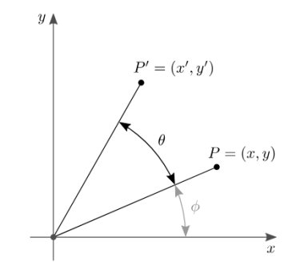
    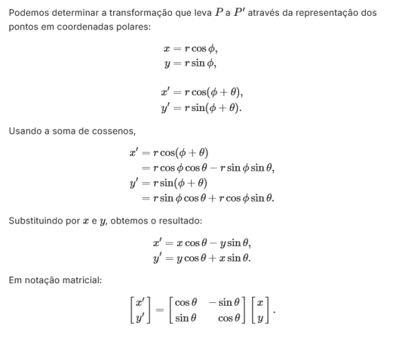
    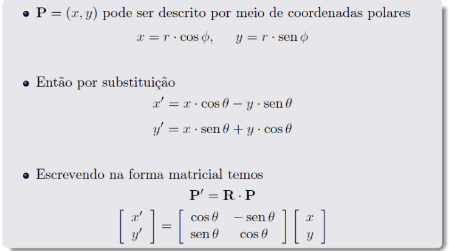
    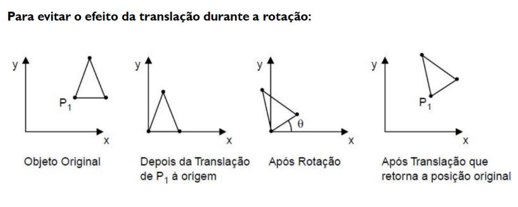

### Escala
- operação que modifica o tamanho de um objeto, podendo expandi-lo ou reduzi-lo, sem alterar sua forma.
- Ao aplicar a escala, cada ponto do objeto é multiplicado por um fator de escala, que define quanto ele aumentará ou diminuirá em uma ou mais direções.
- #### Características
    - **Fatores de Escala**: determinam quanto cada eixo será aumentado ou reduzido.
        -  **Escala uniforme**: usa o mesmo fator para todos os eixos, mantendo as proporções do objeto. Por exemplo, multiplicar todos os pontos por um fator de 2 dobra o tamanho do objeto em todas as direções.
        -  **Escala não uniforme**: aplica fatores diferentes a cada eixo, podendo alterar as proporções do objeto, tornando-o mais largo, alto ou profundo.
- #### Como é calculado
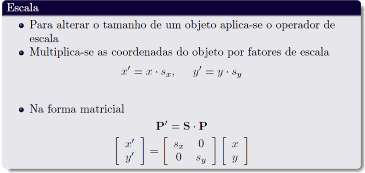
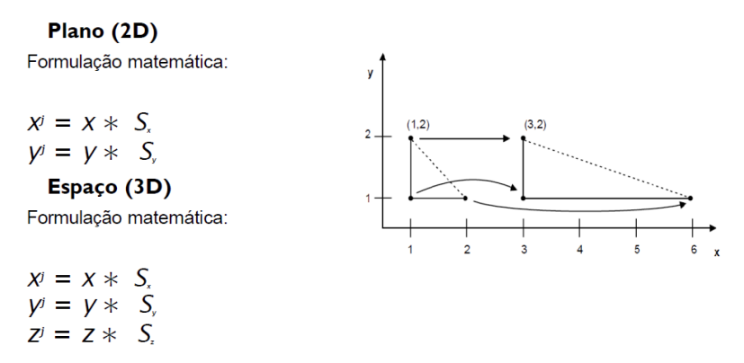
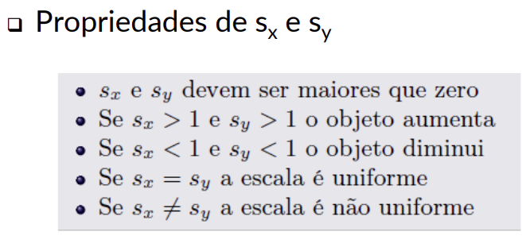
- como a escala altera a distância entre os pontos, ela **não é uma transformação de corpo rígido**
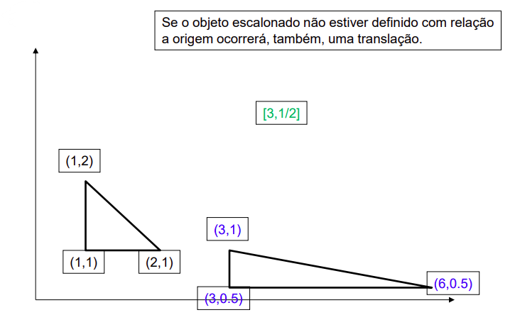

-----
### Coordenadas Homogêneas
- forma estendida de representar pontos em um sistema de coordenadas, adicionando um fator extra para facilitar operações como translações, rotações e projeções. 
- Rotação e escala podem ser executadas com o uso de multiplicação de matrizes, a transformação de translação não. Portanto, para solucionar esse e outros problemas é recomendado o uso de coordenadas homogêneas para todas as operações.
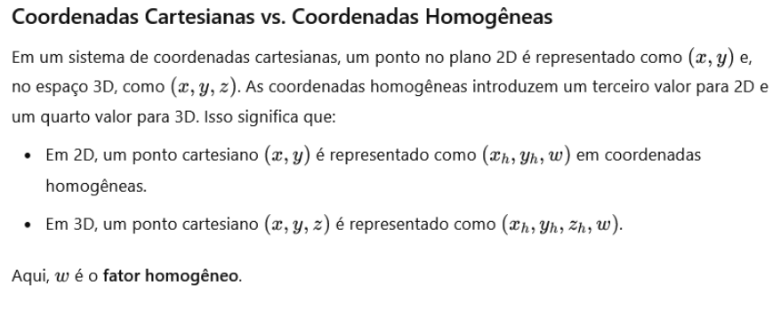
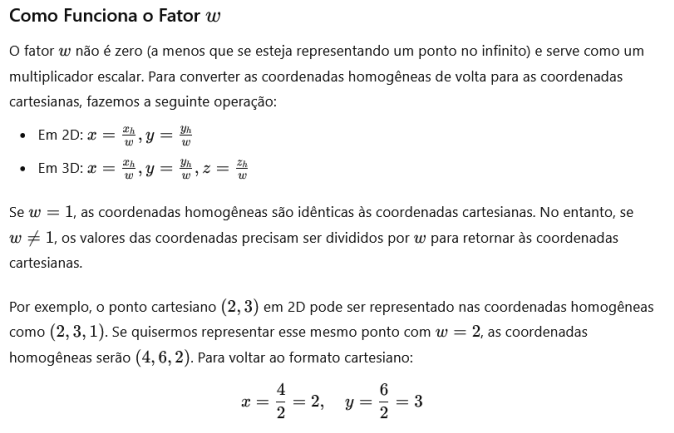
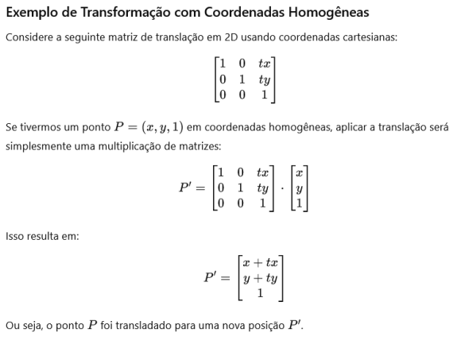

    - #### Translação 2D
        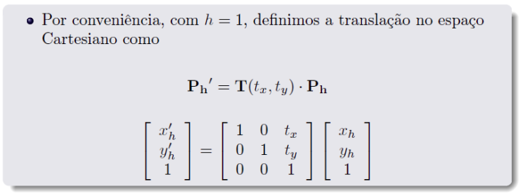
    - #### Rotação 2D
        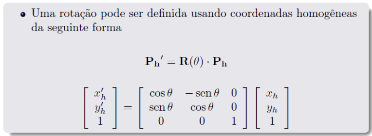
    - #### Escala 2D
        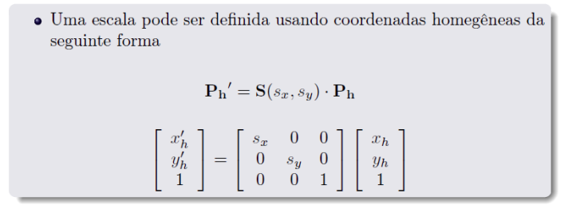

### Transformações 2D compostas
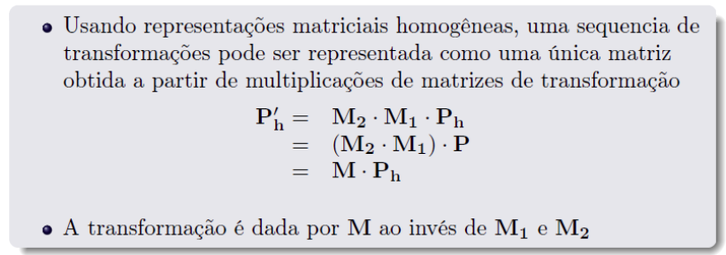

- #### Translação composta
    - só ir somando elas
     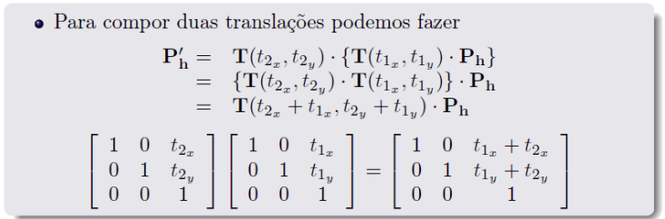
- #### Rotação composta
    - soma os angulos, entao se pedir uma de 90 e outra de 45, pode fazer uma de 135
     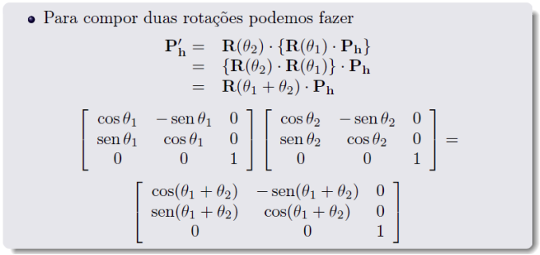
- #### Escala composta
    - basta multiplicar
     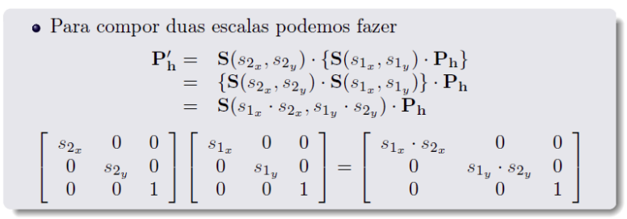
        

