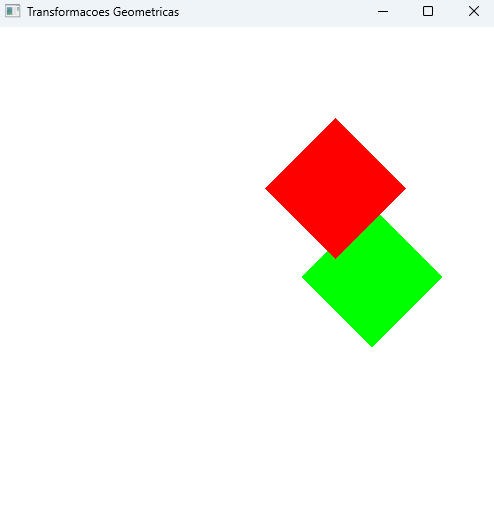
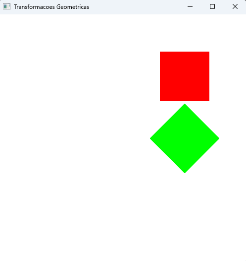

# Prática OpenGL - Transformações geométricas

- As transformações são cumulativas
- **Não** são comutativas
    
    - ```
        void display()
        {
        glClear(GL_COLOR_BUFFER_BIT);
        
        // quadrado 1
        color[0] = 0; color[1] = 1; color[2] = 0; 
        glPushMatrix();
        glTranslatef(0.5, 0.0, 0.0);
        glRotatef(45.0, 0.0, 0.0, 1.0);
        desenhaQuadrado(xPos, yPos);
        glPopMatrix();

        // quadrado 2
        color[0] = 1; color[1] = 0; color[2] = 0; 
        glPushMatrix();
        glRotatef(45.0, 0.0, 0.0, 1.0);
        glTranslatef(0.5, 0.0, 0.0);
        desenhaQuadrado(xPos, yPos);
        glPopMatrix();

        glFlush();
        }
    
    - mudando a ordem das transformações temos o output:
         

- O comando glPushMatrix e Pop servem para a transformação em um quadrado não afetar o outro, basicamente colocando a matrix na stack e removendo ela depois
    - exemplo de output, não usando o glPush e Pop:
        